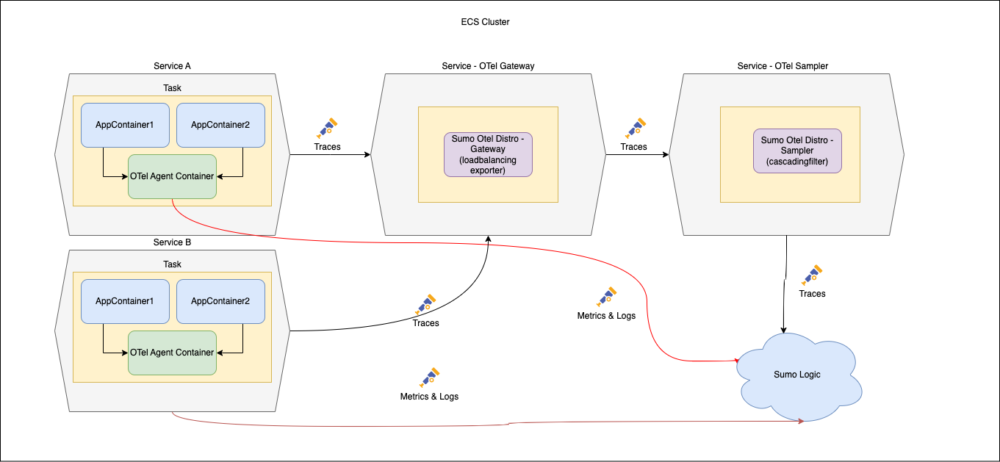

# Sumo Logic Distribution for OpenTelemetry Collector, AWS example

This paper explains configuration for "gateway" type deployment for Metrics and Traces.

## Sumo OTel Distro

Latest release: https://github.com/SumoLogic/sumologic-otel-collector/releases

### Sumo OTel Distro as Agent

Sumo OTel Distro deployed as Agent is mostly responsible for collecting data from instrumentation, metadata tagging and AWS ECS metrics collection. Metrics are passed directly to Sumo Logic by [OTLP/HTTP endpoint](https://help.sumologic.com/docs/send-data/hosted-collectors/http-source/otlp/). Traces are passed to Sumo OTel Distro Gateway.
Please see [Agent example configuration for more details.](./configs/agent-config.yaml).

### Sumo OTel Distro as Gateway

Collector deployed as Gateway is reposponsible for matching addreesses of the Sumo OTel Distro Sampler with `trace_id`. This ensures that spans from the same trace go to one and the same sampler instance. Specific exporter called [loadbalancingexporter](https://github.com/open-telemetry/opentelemetry-collector-contrib/blob/main/exporter/loadbalancingexporter/README.md) is used for that purpose. Please see [Gateway example configuration for more details.](./configs/gateway-config.yaml).

### Sumo OTel Distro as Sampler

Sampler is responsible for [filtering traces based on various filter rules](https://github.com/SumoLogic/sumologic-otel-collector/tree/v0.86.0-sumo-0/pkg/processor/cascadingfilterprocessor) and sending them to Sumo using [OTLP/HTTP endpoint](https://help.sumologic.com/docs/send-data/hosted-collectors/http-source/otlp/).

The most important thing related to filtering is to remember to adjust the configuration (global number of sent spans and number of spans for individual rules) for the number of sampler instances. Let's assume that we want to send a maximum of 100,000 spans per second and to handle such traffic we need 5 sampler instances. Therefore, the configuration looks like this: spans_per_second = 100,000/5 which is `spans_per_second = total_number_of_spans_we_want_to_send / sampler_instances_count`.

Please see [Sampler example configuration for more details.](./configs/sampler-config.yaml).
