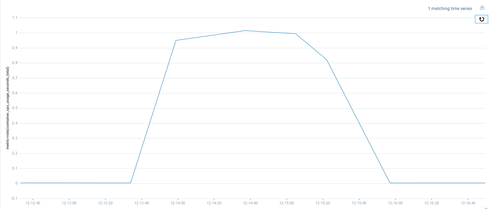
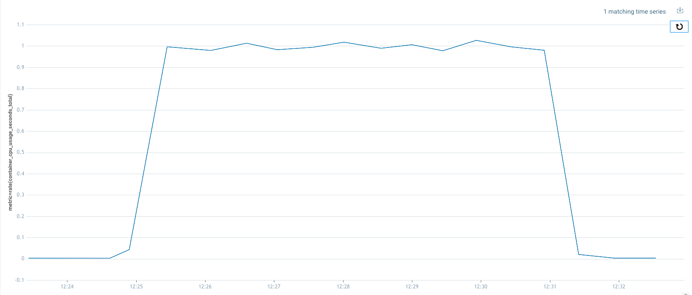
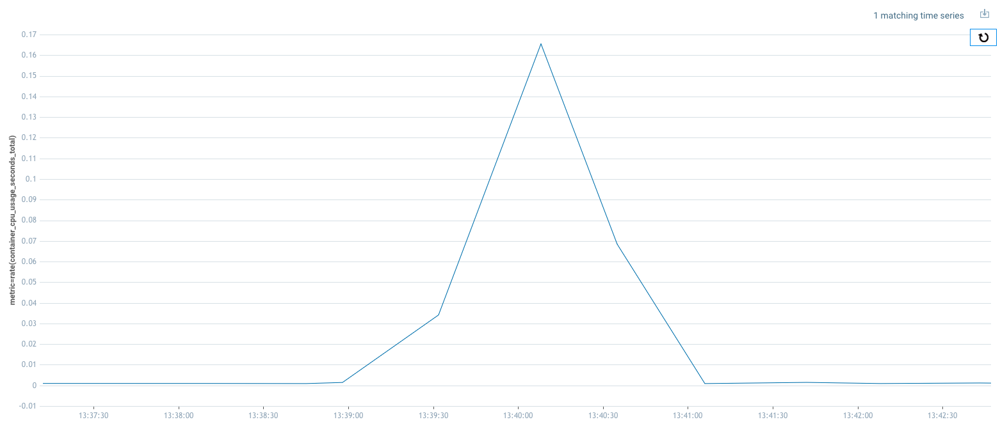
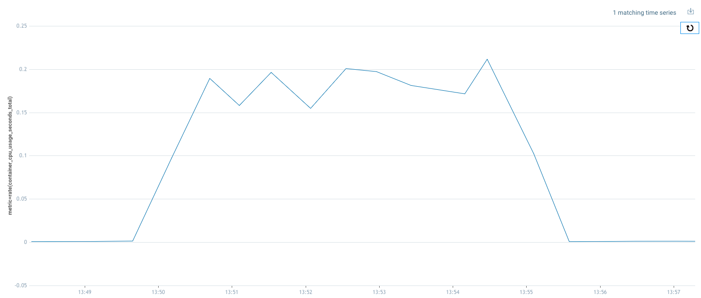

# Sumo Logic Kubernetes Collection - FluentD vs OpenTelemetry Collector

Performance differences between `FluentD` and `OpenTelemetry Collector` deployed by [Sumo Logic Collection v2.19.1](https://github.com/SumoLogic/sumologic-kubernetes-collection/blob/v2.19.1/deploy/README.md) and [Sumo Logic Collection v3.14.0](https://github.com/SumoLogic/sumologic-kubernetes-collection/blob/v3.14.0/docs/README.md)

## Deployment Configuration

Requirements:

- [AWS Credentials](https://docs.aws.amazon.com/cli/latest/userguide/cli-chap-configure.html)
- [eksctl](https://eksctl.io/)
- [kubectl](https://kubernetes.io/docs/tasks/tools/#kubectl)
- [helm](https://helm.sh/docs/intro/install/)

### Cluster installation

1. Create test cluster cluster

    ```bash
    eksctl create cluster -f ./configuration/cluster.yaml
    ```

    Cluster will be created under the name `skc-cluster` - [details](./configuration/cluster.yaml).

    **NOTE:** Cluster will be deployed with `Kubernetes 1.23`.

1. Associate IAM OIDC Provider

    ```bash
    eksctl utils associate-iam-oidc-provider --region=us-east-1 --cluster=skc-cluster --approve
    ```

1. Create IAM Service Account Role used by EBS CSI Driver

    ```bash
    eksctl create iamserviceaccount \
        --name ebs-csi-controller-sa \
        --namespace kube-system \
        --cluster skc-cluster \
        --role-name AmazonEKS_EBS_CSI_DriverRoleSkcCluster \
        --role-only \
        --attach-policy-arn arn:aws:iam::aws:policy/service-role/AmazonEBSCSIDriverPolicy \
        --approve
    ```

1. Add EBS-CSI addon to the cluster

    Replace [YOUR_AWS_ACCOUNT_ID](https://docs.aws.amazon.com/IAM/latest/UserGuide/console_account-alias.html) in the command.

    ```bash
    eksctl create addon --name aws-ebs-csi-driver --cluster skc-cluster --service-account-role-arn arn:aws:iam::821986006950:role/AmazonEKS_EBS_CSI_DriverRoleSkcCluster --force
    ```

1. Install K8s Metrics Server

    ```bash
    kubectl apply -f https://github.com/kubernetes-sigs/metrics-server/releases/latest/download/components.yaml
    ```

1. (optional) Install K8s Dashboard

    - Deploy K8s Dashboard

        ```bash
        kubectl apply -f https://raw.githubusercontent.com/kubernetes/dashboard/v2.7.0/aio/deploy/recommended.yaml
        ```

    - Configure Service Account to access K8s Dashboard

        ```bash
        kubectl apply -f ./configuration/eks-admin.yaml
        ```

    **Note:** You can access the dashboard using `kubectl proxy`. To retrieve the secret execute `kubectl describe secret eks-admin -nkube-system`.

## Tests for Sumo Logic Collection V2 - FluentD

1. Deploy Sumo Logic Kubernetes Collection

    - Set your Sumo Logic Access Id and Key in [skc-v2-values.yaml](./v2/skc-v2-values.yaml)
    - Get Sumo Logic Collection repo chart

        ```bash
        helm repo add sumologic https://sumologic.github.io/sumologic-kubernetes-collection
        ```

    - Deploy Sumo Logic Collection chart using [helm](https://helm.sh/docs/intro/install/)

        ```bash
        helm upgrade --install collection sumologic/sumologic \
        --create-namespace \
        --namespace sumologic \
        --version 2.19.1 \
        -f ./v2/skc-v2-values.yaml
        ```

1. Fluentd - Logs

    [Sumo Logic Kubernetes Tools - Logs Generator](https://github.com/SumoLogic/sumologic-kubernetes-tools/tree/main/src/rust/logs-generator) was used to generate logs.

    FluentD - Logs resources: <https://github.com/SumoLogic/sumologic-kubernetes-collection/blob/v2.19.1/deploy/helm/sumologic/values.yaml#L487-L495>

    - 1 minute, 5 megabytes of logs per second (in total 300 MB of logs)

        - Generate logs:

            ```bash
            kubectl apply -f logs-generator/logs-generator-1min5mb.yaml
            ```

        - Logs generator output:

            ```txt
            39745 pps     5000095 b/s
            Total stats: 2393520 logs, 300002595 bytes
            Logs generation finished after 60 seconds
            Sent 2393520 logs in total
            Sent 300002595 bytes in total
            ```

        Logs Metric query: <https://stagdata.long.sumologic.net/ui/#/metricsv2/IlVLO42VzgokA7frwhQKhBd0SGLjymgv7Z7cPo96>

        | Resource | Results |
        |--------|--------|
        | CPU IMG |   |
        | CPU Description | Logs were generated during 1 minute but `Fluentd Logs` was processing them for over 2,5 minutes |
        | Memory | Didn't observe any memory spikes. |

    - 5 minutes, 5 megabytes of logs per second (in total 1,5GB of logs)

        - Generate logs:

            ```bash
            kubectl apply -f logs-generator/logs-generator-5min5mb.yaml
            ```

        - Logs generator output:

            ```txt
            43163 pps     5000057 b/s
            Total stats: 13045040 logs, 1500016521 bytes
            Logs generation finished after 300 seconds
            Sent 13045040 logs in total
            Sent 1500016521 bytes in total
            ```

        Logs Metric query: <https://stagdata.long.sumologic.net/ui/#/metricsv2/6NMoGuegC0B9RT6hAZf5XeuCqrujaFFtdC7t5i3K>

        | Resource | Results |
        |--------|--------|
        | CPU IMG |   |
        | CPU Description | Logs were generated during 5 minutes but `Fluentd Logs` was processing them for over 2,5 minutes |
        | Memory | Didn't observe any memory spikes. |

    - 15 minutes, 5 megabytes of logs per second (in total 4,5 GB of logs)
        - Generate logs:

            ```bash
            kubectl apply -f logs-generator/logs-generator-15min5mb.yaml
            ```

        - Logs generator output:

            ```txt
            38144 pps     5000109 b/s
            Total stats: 34412290 logs, 4500060569 bytes
            Logs generation finished after 900 seconds
            Sent 34412290 logs in total
            Sent 4500060569 bytes in total
            ```

        Logs Metric query: <https://stagdata.long.sumologic.net/ui/#/metricsv2/kg8m13fPQ51GmoZwTilNBiSs4GWLJYn050wo2ZP7>

        | Resource | Results |
        |--------|--------|
        | CPU IMG |   |
        | CPU Description | Logs were generated during 15 minutes and `Fluentd Logs` was processing them for over 16 minutes using all the time maximum CPU resources |
        | Memory | Didn't observe any memory spikes. |

    **Note:** FluentD Logs uses 100% of the CPU to process logs. In every case it takes longer than logs generation time. Memory spikes were not observed. To obtain better performance FluentD instances has to be scaled up as FluentD itself has a 1 CPU resource limitation. 

1. FluentD - Metrics

// TODO

## Tests for Sumo Logic Collection V3 - OpenTelemetry Collector

1. Deploy Sumo Logic Kubernetes Collection

    - Set your Sumo Logic Access Id and Key in [skc-v3-values.yaml](./v3/skc-v3-values.yaml)
    - Get Sumo Logic Collection repo chart

        ```bash
        helm repo add sumologic https://sumologic.github.io/sumologic-kubernetes-collection
        ```

    - Deploy Sumo Logic Collection chart using [helm](https://helm.sh/docs/intro/install/)

        ```bash
        helm upgrade --install collection sumologic/sumologic \
        --create-namespace \
        --namespace sumologic \
        --version 3.14.0 \
        -f ./v3/skc-v3-values.yaml
        ```

1. Otelcol - Logs

    [Sumo Logic Kubernetes Tools - Logs Generator](https://github.com/SumoLogic/sumologic-kubernetes-tools/tree/main/src/rust/logs-generator) was used to generate logs.

    Otelcol - Logs resources: <https://github.com/SumoLogic/sumologic-kubernetes-collection/blob/v3.14.0/deploy/helm/sumologic/values.yaml#L891-L899>

    - 1 minute, 5 megabytes of logs per second (in total 300 MB of logs)

        - Generate logs:

            ```bash
            kubectl apply -f logs-generator/logs-generator-1min5mb.yaml
            ```

        - Logs generator output:

            ```txt
            33672 pps     5000038 b/s
            Total stats: 2027660 logs, 300002698 bytes
            Logs generation finished after 60 seconds
            Sent 2027660 logs in total
            Sent 300002698 bytes in total
            ```

        Logs Metric query: <https://stagdata.long.sumologic.net/ui/#/metricsv2/gX7LnWsfGimTa94LMVzfN7KAYRXJBiW1asKHAkd9>

        | Resource | Results |
        |--------|--------|
        | CPU IMG |   |
        | CPU Description | Logs were generated during 1 minute, CPU usage was on the low level around 16%. |
        | Memory | Didn't observe any memory spikes which should be considered here. Collector was consuming extra 40 MBs (in total 90MB) to process all the data. |

    - 5 minutes, 5 megabytes of logs per second (in total 1,5GB of logs)

        - Generate logs:

            ```bash
            kubectl apply -f logs-generator/logs-generator-5min5mb.yaml
            ```

        - Logs generator output:

            ```txt
            44861 pps     5000057 b/s
            Total stats: 13558580 logs, 1500019291 bytes
            Logs generation finished after 300 seconds
            Sent 13558580 logs in total
            Sent 1500019291 bytes in total
            ```

        Logs Metric query: <https://stagdata.long.sumologic.net/ui/#/metricsv2/s6DJHz0aVGwU47MOoaBuDiqHHdVV3743E87sR8EP>

        | Resource | Results |
        |--------|--------|
        | CPU IMG |   |
        | CPU Description | Logs were generated during 5 minutes, average CPU usage was on the 20% level. |
        | Memory | Didn't observe any memory spikes which should be considered here. Collector was consuming extra 40 MBs (in total 90MB) to process all the data. |

    - 15 minutes, 5 megabytes of logs per second (in total 4,5 GB of logs)
        - Generate logs:

            ```bash
            kubectl apply -f logs-generator/logs-generator-15min5mb.yaml
            ```

        - Logs generator output:

            ```txt
            33796 pps     5000085 b/s
            Total stats: 34412290 logs, 4500067472 bytes
            Logs generation finished after 900 seconds
            Sent 34412290 logs in total
            Sent 4500060569 bytes in total
            ```

        Logs Metric query: <https://stagdata.long.sumologic.net/ui/#/metricsv2/2x1Bnra62OmTV0yr4PKPfwyUin9hBBLK3YgQebMn>

        | Resource | Results |
        |--------|--------|
        | CPU IMG |   |
        | CPU Description | Logs were generated during 5 minutes, average CPU usage was on average 15% level. |
        | Memory | Didn't observe any memory spikes which should be considered here. Collector was consuming extra 40 MBs (in total 90MB) to process all the data. |

    **NOTE:** OpenTelemetry Collector in comparison to FluentD doesn't have any issues with increasing resources like CPUs. It can be simply scaled horizontally and vertically.

    **NOTE:** OpenTelemetry Collector uses at least 5x less memory than FluentD. 

### Cluster cleanup

1. Delete Sumo Logic Kubernetes Collection

```bash
helm delete collection -nsumologic
```
